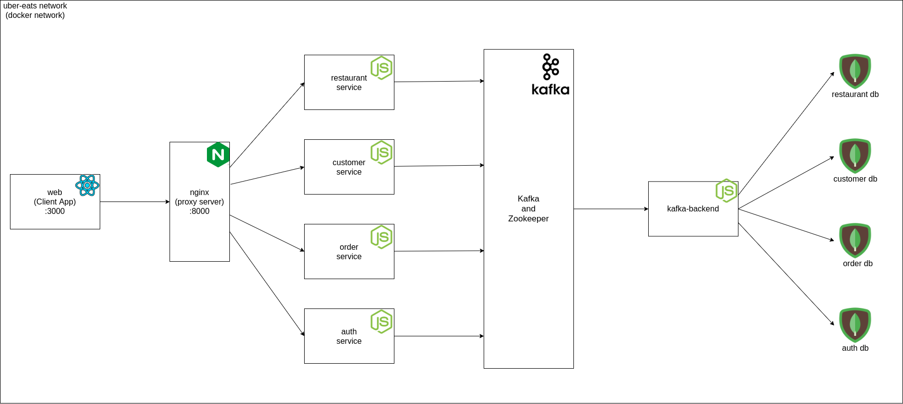

# Uber Eats Clone

In this project a food delivery system is being developed in which restaurants and customers register themselves. This system is similar to Uber Eats application. The tech
stack used to develop the system consist of Node.js (Express) for backend, React for frontend and MongoDB for database and Kafka as message broker service. User can
register themself as customer or restaurant. Restaurant users can add/update/delete the dishes which they serve and can see/update the orders that are done by the customers.
Customer orders can see the restaurants in their city and can filter through the restaurants and can order dishes from the restaurants. 

## System Design 

## How to Run
* There is sample config file (config.json) in each service folders which you should edit with proper values. (To run in develop mode no need to edit any file)
* To run the servers and frontend (web) just run `docker-compose up`
* Access the web app at `localhost:3000`
* Following are the API Docs URL for each service
  - Auth: `localhost:7000/api-docs`
  - Restaurant: `localhost:7001/api-docs`
  - Customer: `localhost:7002/api-docs`
  - Order: `localhost:7003/api-docs`
